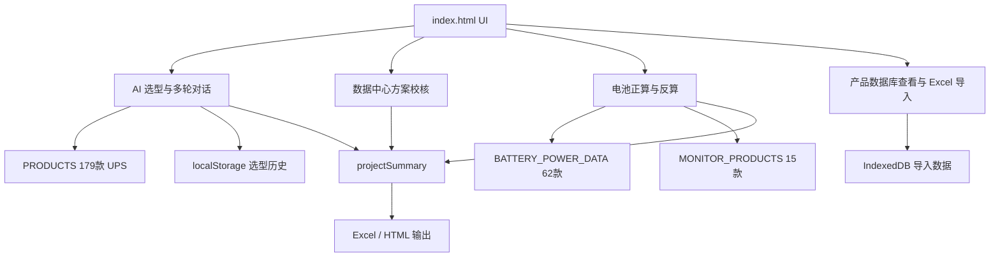

# UPS 智能选型助手——产品与技术设计

> 版本：v1.8.0
> 最后更新：2026-07-03
> 文档职责：说明产品能力、系统结构、关键数据流、业务公式和技术边界。

## 1. 产品定位

UPS 智能选型助手是面向售前、销售和技术人员的单文件 Web 工具。它把客户技术要求、产品数据、UPS 容量校核、电池配置和项目汇总整合到一个页面中。

正式交付物只有 `index.html`。用户可直接双击使用；涉及 CDN 文档解析、浏览器安全限制或稳定调试时，建议通过本地 HTTP 服务打开。

### 1.1 核心目标

- 从客户需求中提取关键 UPS 参数并调用 AI 推荐型号。
- 用本地产品数据库约束 AI 输出，降低型号幻觉。
- 完成数据中心容量与冗余架构校核。
- 完成电池正向选型、后备时间反算、开关箱和监控配置。
- 生成项目配置汇总、Excel 清单和客户可读技术说明。

### 1.2 非目标

- 本工具不是最终电气设计软件，不能替代厂家曲线、短路计算、选择性保护和施工图设计。
- 页面内访问码和价格查看码仅是客户端使用门槛，不构成真正的安全控制。
- AI 输出必须经过产品数据库和工程人员复核，不能直接作为采购承诺。

## 2. 当前能力

| 能力 | 说明 |
|---|---|
| AI 智能选型 | 支持 OpenAI 兼容接口和 Anthropic 接口，多轮追问，合法型号过滤 |
| 产品数据库 | 内置 179 款 UPS，支持 Excel 导入和 IndexedDB 持久化 |
| 数据中心校核 | 支持 N、N+1、2N、分布式冗余容量及风险提示 |
| UPS 与电池配置 | 统一计算电池、开关箱、监控和项目汇总，汇总清单支持自定义增加行、上下排序、删除当前行、非标描述、手工补充编码/单价和快速报价单导出 |
| 电池后备时间反算 | 根据恒功率曲线估算现有电池配置的后备时间 |
| 独立电池计算 | 铅酸方法一和锂电池容量计算 |
| 文档输入 | TXT、MD、DOCX、PDF；图片通过支持视觉的 AI 模型识别 |
| 结果输出 | 推荐方案 HTML、项目汇总 Excel、技术说明 HTML、历史记录 Excel |
| 历史记录 | localStorage 保存最多 50 条选型记录，可搜索、恢复和导出 |

## 3. 数据规模

| 数据集 | 数量 | 位置 |
|---|---:|---|
| UPS 产品 | 179 | `index.html` 中 `PRODUCTS` |
| 太行 UR | 21 | `PRODUCTS` |
| 昆仑 UE | 39 | `PRODUCTS` |
| 祁连 UM | 22 | `PRODUCTS` |
| 泰山 UT | 97 | `PRODUCTS` |
| 电池恒功率型号 | 62 | `index.html` 中 `BATTERY_POWER_DATA` |
| 电池监控产品 | 15 | `index.html` 中 `MONITOR_PRODUCTS` |

电池类别：

- `normal`：SP12V
- `highpower`：SPG12V 高功率
- `2v`：GFMD-2V
- `dianneng`：电能 GBT12-20 小时率
- `dianneng10h`：电能 GBT12-10 小时率
- `custom`：客户指定型号，不进行内置型号推荐

## 4. 系统结构



### 4.1 单文件架构

单文件是明确的产品约束，而不是尚未完成的拆分：

- 便于内部人员复制和直接打开。
- 产品和电池数据可内嵌，基础选型不依赖后端。
- GitHub Pages 和 Netlify 只需发布一个文件。

代价是文件较大，因此通过以下方式控制复杂度：

- 每类业务保持单一实现，不保留失去 UI 入口的旧函数。
- 关键公式提炼为纯函数并独立测试。
- 自动检查 HTML 层级、DOM ID、函数重复和 JavaScript 语法。
- 文档不记录易漂移的绝对行号，以函数名和数据名定位。

## 5. 主要模块

### 5.1 启动与配置

| 标识 | 职责 |
|---|---|
| `APP_VERSION` | 页面与文档版本的唯一代码来源 |
| `checkAuth` | 客户端访问门槛 |
| `saveConfig` / `getBaseUrl` | 保存和读取 AI 接口配置 |
| `getCustomPrompt` | 返回自定义或默认系统提示词 |
| `DEBUG_MODE` / `debugLog` | 控制开发日志，生产默认关闭 |

### 5.2 AI 选型

| 函数 | 职责 |
|---|---|
| `buildProductSummary` | 构建发送给 AI 的压缩产品摘要 |
| `callAI` | 统一调用 OpenAI 兼容接口或 Anthropic |
| `analyze` | 首次选型主流程 |
| `validateModels` | 删除不在合法型号列表中的 AI 推荐 |
| `renderResult` | 渲染推荐和备选产品 |
| `sendFollowup` | 多轮追问 |

AI 结果约定：

```json
{
  "analysis": "需求解析、容量判断、匹配逻辑和风险提示",
  "recommended": [
    { "model": "合法产品型号", "reason": "推荐原因" }
  ],
  "also_consider": [
    { "model": "合法产品型号", "reason": "备选原因" }
  ]
}
```

### 5.3 产品数据

| 函数 | 职责 |
|---|---|
| `importExcel` | 解析产品 Excel，并合并基础表与泰尔规格表 |
| `openDatabase` | 打开 IndexedDB |
| `saveProductsToDB` | 持久化导入数据 |
| `loadProductsFromDB` | 页面启动时恢复导入数据 |
| `restoreBuiltinData` | 清除导入数据并恢复内置数据库 |
| `buildDataTable` | 构建双栏产品数据库视图 |

### 5.4 数据中心校核

| 函数 | 职责 |
|---|---|
| `updateDcArchitectureFields` | 根据架构切换台数字段 |
| `importDcFromCurrentSelection` | 从统一配置或 AI 首选型号导入 |
| `calcDataCenterCheck` | 计算装机容量、可用容量、负载率和风险 |

### 5.5 电池与项目配置

| 函数 | 职责 |
|---|---|
| `calcAllBatteryConfig` | 当前唯一正式的统一电池配置流程 |
| `calculateBatteryElectricals` | 纯函数：单体功率、总电流、分组电流、传感器电流 |
| `getNextBreakerSize` | 纯函数：选择大一档标准断路器 |
| `selectCurrentSensor` | 纯函数：选择电流传感器量程 |
| `getVoltLevel` | 纯函数：按最大充电电压选择 DC 电压等级 |
| `calcBatteryRuntime` | 按恒功率曲线反算后备时间 |
| `renderProjectSummary` | 渲染统一项目清单 |
| `exportProjectSummary` | 导出项目配置 Excel |
| `exportTechnicalBrief` | 导出客户可读技术说明 HTML |

## 6. 核心数据流

### 6.1 AI 选型

1. 用户输入需求或上传文档。
2. `analyze` 组合需求、系统提示词、产品摘要和合法型号列表。
3. `callAI` 调用模型。
4. `validateModels` 过滤非法型号。
5. `renderResult` 展示结果。
6. `saveSelectionHistory` 保存快照。

### 6.2 统一电池配置

1. 读取 UPS、负载、电池和监控参数。
2. 输入校验。
3. `calculateBatteryElectricals` 计算关键电气量。
4. 从 `BATTERY_POWER_DATA` 中选择满足恒功率要求的型号。
5. 计算开关规格、电压等级和传感器量程。
6. 生成监控配置。
7. 写入 `window.projectSummary`。
8. 渲染和导出项目汇总。

### 6.3 后备时间反算

1. 计算每台 UPS、每组电池、每只电池承担的功率。
2. 获取指定截止电压下的恒功率曲线。
3. 在相邻功率点之间线性估算时间。
4. 对目标时间给出满足、临界或不满足提示。
5. 客户指定电池没有内置曲线时只输出所需功率，不伪造时间。

## 7. 关键业务公式

### 7.1 电池单体功率

```text
负载功率 loadW =
  已填写负载功率 × 1000
  否则 UPS容量 × 功率因数 × 1000

单体所需功率 =
  loadW ÷ (每组电池节数 × 单格数 × 逆变效率 × 每台UPS电池组数)

单格数：
  12V电池 = 6
  2V电池  = 1
```

### 7.2 电池开关箱电流

开关箱必须按 UPS 额定功率计算，不使用可选负载功率：

```text
switchW = UPS容量 × 功率因数 × 1000

最大放电电流 =
  switchW ÷ (每组电池节数 × 截止电压 × 单格数 × 逆变效率)

分开关电流 =
  最大放电电流 ÷ (电池组数 - 1)，仅组数 ≥ 2 时有效
```

### 7.3 传感器量程

```text
电池组数 = 1：
  传感器电流 = 最大放电电流

电池组数 ≥ 2：
  传感器电流 = 分开关电流
```

| 计算电流 | 产品编码 | 量程 |
|---:|---|---|
| ≤100A | 88091139 | 0~100A |
| ≤200A | 88091140 | 0~200A |
| ≤400A | 88091141 | 0~400A |
| ≤600A | 88091142 | 0~600A |
| ≤800A | 88091143 | 0~800A |
| >800A | 88091144 | 0~1000A |

### 7.4 断路器规格

从标准规格数组中选择严格大于计算电流的第一档；超过最大档位时返回 1600A，并要求工程复核。

### 7.5 电压等级

```text
最大充电电压 = 2.35V × 单格数 × 电池节数

≤250V  → 250VDC
≤500V  → 500VDC
>500V  → 750VDC
```

### 7.6 电池架铜排或电缆

```text
单组电池：采用主开关规格
多组电池：采用分开关规格
```

### 7.7 数据中心架构

- N：全部 UPS 共同承担负载，无冗余故障后容量概念。
- N+1：输入 N 台工作/并机 UPS，总台数为 N+1，故障后按 N 台容量校核。
- 2N：A、B 两路分别输入台数，任一路必须独立承担全部负载。
- 分布式冗余：先按近似 N+1 校核，并明确提示结合实际母线拓扑复核。

## 8. 状态与存储

| 存储 | 键/对象 | 内容 |
|---|---|---|
| localStorage | `ups_config` | AI 提供商、模型、API Key、Base URL |
| localStorage | `ups_custom_prompt` | 自定义系统提示词 |
| localStorage | `ups_selection_history` | 最多 50 条选型历史 |
| IndexedDB | `ups_data_db` | 用户导入的产品数据 |
| 内存 | `window.projectSummary` | 当前项目汇总 |
| 内存 | `lastResult` | 当前 AI 选型结果 |

API Key 保存在浏览器本地存储中，适合受控内部环境，不适合公共终端。

## 9. 外部运行依赖

正式页面通过 CDN 加载：

- `xlsx-js-style`：Excel 读写和样式。
- `mammoth.js`：DOCX 文本提取。
- `pdf.js`：PDF 文本提取。

基础产品查看和内置计算不依赖这些库；Excel、DOCX、PDF 功能在 CDN 不可用时应显示明确错误。

本地开发依赖：

- Python 标准库：HTML 层级和 DOM 结构审计。
- `openpyxl`：Excel 数据检查。
- `watchdog`：可选文件监听。
- Node.js 标准运行时：JavaScript 语法和业务规则测试，无 npm 依赖。

## 10. 安全边界

- 客户端访问码可从源码读取，只能阻挡误操作。
- 价格查看码同样不是加密或权限系统。
- 线上部署制品只包含 `index.html`，不得发布 Excel 模板、MCP 配置和开发记录。
- 不在代码仓库中写入真实 API Key。
- 导出内容必须对用户输入做 HTML 转义。

## 11. 质量要求

每次发布必须满足：

- 所有内联 JavaScript 可被 Node.js 编译。
- HTML 核心面板层级正确，客户需求卡片不在隐藏容器内。
- DOM ID 和函数定义无重复。
- 活动代码不引用不存在的静态 DOM ID。
- 179 款产品 JSON 可解析。
- 版本号在页面和三份文档中一致。
- 断路器、电池电气量、传感器和电压等级业务测试通过。
- Playwright 至少覆盖登录、五个主功能面板、数据库和设置/历史弹窗。

## 12. 版本摘要

| 版本 | 日期 | 主要变更 |
|---|---|---|
| v1.4 | 2026-03-20 | UPS、电池、开关箱、监控和项目汇总联动 |
| v1.5 | 2026-03-24 | 电池架和开关品牌选项 |
| v1.6 | 2026-04-01 | 历史记录、图片识别、Excel 行高优化 |
| v1.6.8 | 2026-05-23 | APP_VERSION 单一版本来源 |
| v1.6.9 | 2026-05-23 | 数据中心方案校核 |
| v1.6.17 | 2026-05-23 | 客户指定电池 |
| v1.7.0 | 2026-05-25 | 电池后备时间反算 |
| v1.7.2 | 2026-06-02 | 项目技术说明 HTML 导出 |
| v1.7.3 | 2026-06-20 | 修复主页面层级、开发服务器和汇总序号；清理死代码，新增业务测试、浏览器回归和部署门禁 |
| v1.7.4 | 2026-06-22 | 电池开关标准档位补充 2000A、2500A、3200A、4000A，修复大电流场景错误回落至 1600A |
| v1.7.5 | 2026-07-01 | 项目配置汇总清单支持自定义增加行和上下排序，并同步页面、Excel 和技术说明导出 |
| v1.7.6 | 2026-07-03 | 项目配置汇总清单支持标准行手工补充编码和单价，并在重新计算后保留价格数据 |
| v1.7.7 | 2026-07-03 | 新增快速报价单 Excel 导出，复用汇总清单顺序、编码、单价和自定义行，并启用工作表保护 |
| v1.7.8 | 2026-07-03 | 项目配置汇总清单新增删除行操作，标准行按本次隐藏处理并同步所有导出 |
| v1.7.9 | 2026-07-03 | 汇总清单列名和顺序参考供配电配置清单调整，新增非标描述列并同步导出 |
| v1.8.0 | 2026-07-03 | 桌面端全站主容器放宽，提升汇总宽表和多列配置窗口可读性 |

更细的历史变更以 Git 提交记录为准。
